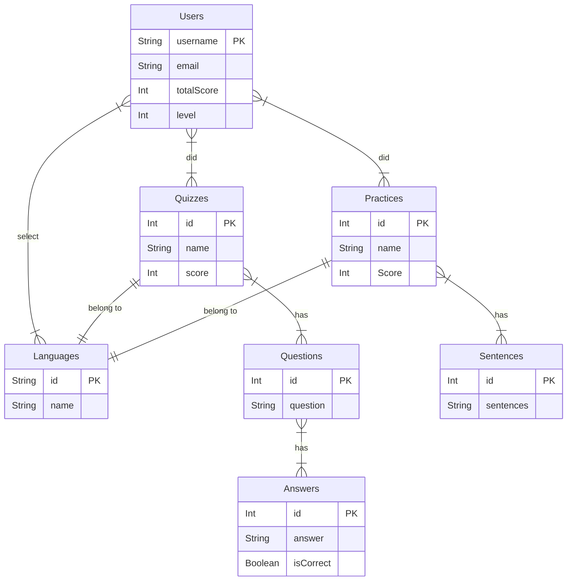

# Database Diagrams

## Entity-Relation Diagram




## NoSQL translated example

```
# Users document
{
	_id: "barrydoan#8032",
	email: "tun70473@temple.edu",
	totalScore: 10,
	level: 1,
	language: "Spanish",
	quizzes: [
		{
			_id: "1",
			name: "Quizz 1",
			score: 5
			tookOn: "2023/10/01",
		}
	],
	practices: [
		{
			_id: "1",
			name: "Practice 1",
			score: "5",
			tookOn: "2023/10/01"
		}
	]
}

# Practice document
{
	_id: "1",
	name: "Practice 1",
	language: "Spanish",
	sentences: [
		{
			sentence: "Cat has four legs"
		},
		{
			sentence: "Chicken has two legs"
		}
	]
}

# Quizz document
{
	_id: "1",
	name: "Quizz 1",
	language: "Spanish",
	questions: [
		{
			question: "How many planets are there in the solar system?"
			answers: [
				{
					answer: "Eight planets",
					isCorrect: true
				},
				{
					answer: "Nine planets",
					isCorrect: false
				},
				{
					answer: "Seven planets",
					isCorrect: false
				},
				{
					answer: "Six planets",
					isCorrect: false
				}
			]
		}
	]
}

```
