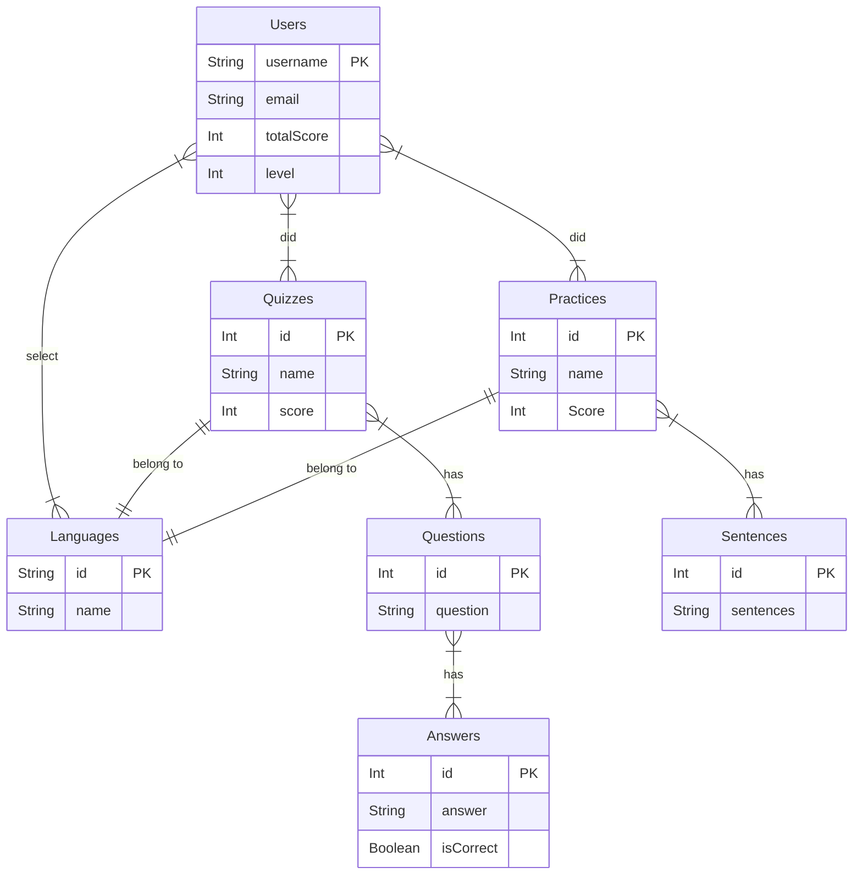

# Database Diagrams

## Entity-Relation Diagram

```mermaid
erDiagram
Users {
  String username PK
  String email
  Int totalScore
  Int level
}

Languages {
  String id PK
  String name
}

Quizzes {
  Int id PK
  String name
  Int score
}

Questions {
  Int id PK
  String question
}

Answers {
  Int id PK
  String answer
  Boolean isCorrect
}

Practices {
  Int id PK
  String name
  Int Score
}

Sentences {
  Int id PK
  String sentences
}

Questions }|--|{ Answers : "has"
Quizzes }|--|{ Questions : "has"
Users }|--|{ Quizzes : "did"
Users }|--|{ Languages : "select"
Quizzes ||--|| Languages : "belong to"

Users }|--|{ Practices : "did"
Practices }|--|{ Sentences : "has"
Practices ||--|| Languages : "belong to"


```
