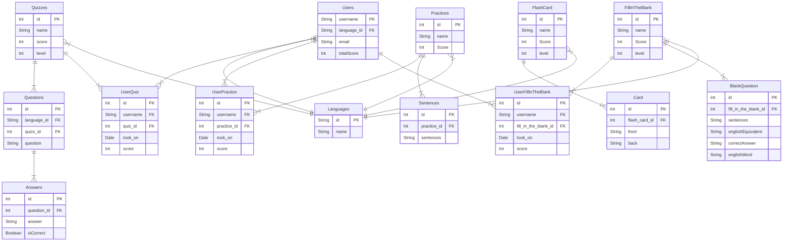

# Database Diagrams

## Entity-Relation Diagram




## NoSQL translated example

```
# Users document
{
	_id: "barrydoan#8032",
	email: "tun70473@temple.edu",
	totalScore: 10,
	language: "Spanish",
	quizzes: [
		{
			_id: "1",
			name: "Quizz 1",
			score: 5
			tookOn: "2023/10/01",
		},
		{
			_id: "1",
			name: "Practice 1",
			score: "5",
			tookOn: "2023/10/01"
		}
	],
}

# Practice document
{
	_id: "1",
	name: "Practice 1",
	language: "Spanish",
	sentences: [
		{
			sentence: "Cat has four legs"
		},
		{
			sentence: "Chicken has two legs"
		}
	]
}

# Quiz document
{
	_id: "1",
	name: "Quiz 1",
	language: "Spanish",
        level: 2
	questions: [
		{
			question: "How many planets are there in the solar system?"
			answers: [
				{
					answer: "Eight planets",
					isCorrect: true
				},
				{
					answer: "Nine planets",
					isCorrect: false
				},
				{
					answer: "Seven planets",
					isCorrect: false
				},
				{
					answer: "Six planets",
					isCorrect: false
				}
			]
		}
	]
}

# fill_in_the_blank document
{
	"name": "Spanish Numbers Set 1",
  	"language": "Spanish",
  	"level": 1,
  	"questions": [
    			{
      				"sentence": "Uno más uno es ___. (dos, tres, cuatro, cinco)",
			      	"englishEquivalent": "One plus one is ___.",
			      	"correctAnswer": "dos",
			      	"englishWord": "two"
			},
			{
			      	"sentence": "Tres menos dos es ___. (uno, dos, tres, cuatro)",
			      	"englishEquivalent": "Three minus two is ___.",
			      	"correctAnswer": "uno",
			      	"englishWord": "one"
			},
			{
			      	"sentence": "Cuatro más uno es ___. (cinco, seis, siete, ocho)",
			      	"englishEquivalent": "Four plus one is ___.",
			      	"correctAnswer": "cinco",
			      	"englishWord": "five"
			},
			{
			      	"sentence": "Cinco más cuatro es ___. (nueve, diez, once, doce)",
			      	"englishEquivalent": "Five plus four is ___.",
			      	"correctAnswer": "nueve",
			      	"englishWord": "nine"
			},
			{
			      	"sentence": "Seis más dos es ___. (ocho, nueve, diez, once)",
			      	"englishEquivalent": "Six plus two is ___.",
			      	"correctAnswer": "ocho",
			      	"englishWord": "eight"
			}
  		]
}

# FlashCard document
{
  	"name": "Unit 2 Set 3",
  	"language": "Spanish",
  	"cards": [
    			{
      				"front": "Which phrase means How much is the subway ticket? in Spanish?",
	      			"back": "¿Cuánto cuesta el boleto de metro?"
	    		},
	    		{
	      			"front": "What is the Spanish word for beer?",
	      			"back": "Cerveza"
	    		},
	    		{
	      			"front": "How would you ask Where is the nearest ATM? in Spanish?",
	      			"back": "¿Dónde puedo encontrar un cajero automático?"
	    		},
	    		{
	      			"front": "What does arroz con pollo mean in English when ordering food in Spanish?",
	      			"back": "Rice with chicken"
	    		},
	    		{
	      			"front": "Which phrase means Excuse me, how do I get to the museum? in Spanish?",
	      			"back": "¿Cómo llego al museo?"
	    		}
  		],
  	"level": 2
}


```
