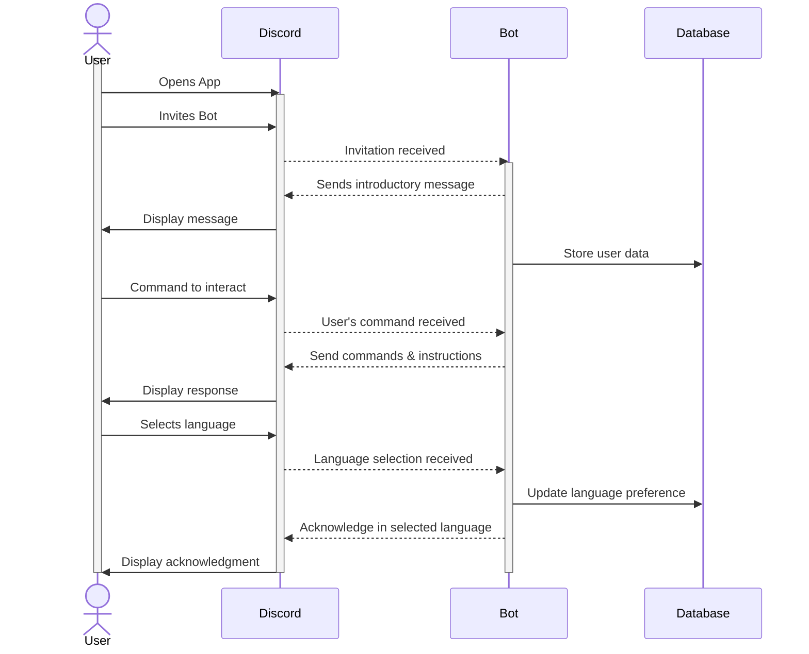
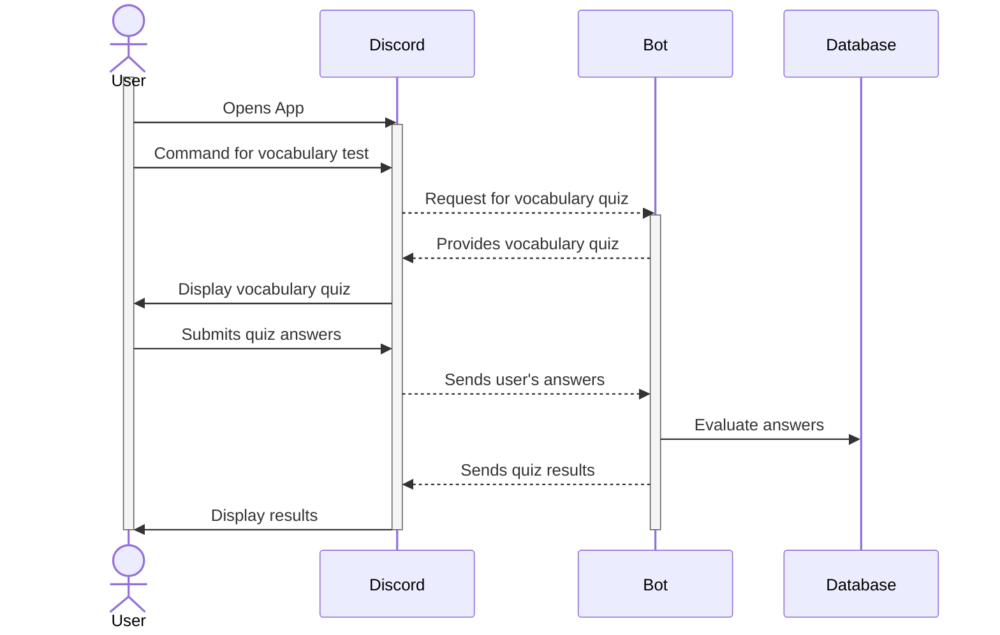
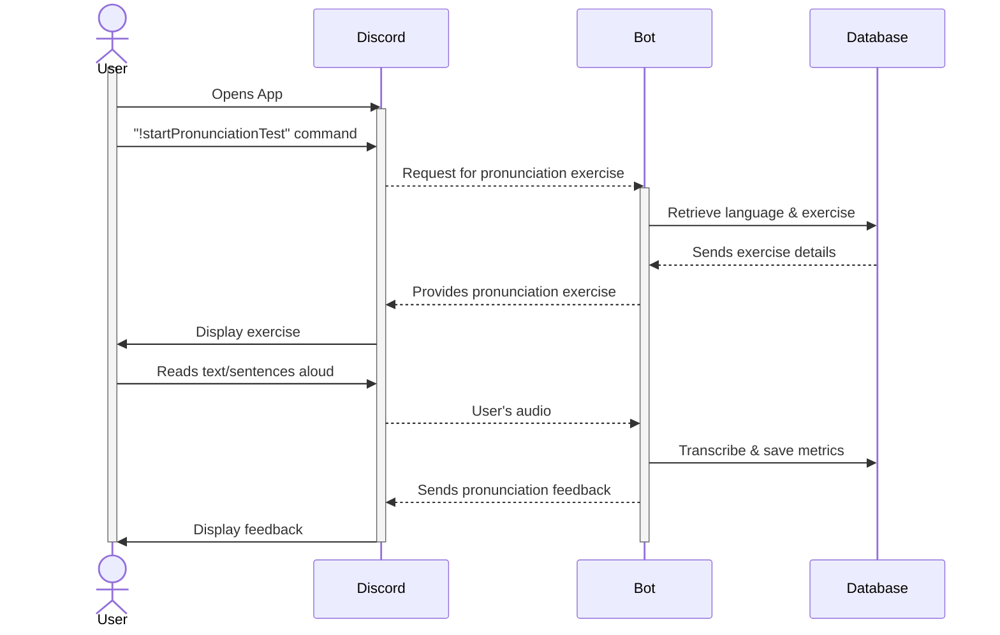

# Sequence Diagram

## Use Case 1

**As a user, it is important that I can create an account so that I can maintain my pet’s growth and my task progress.**

    1: User opens the Discord App.

    2: User invites the bot to the server.

    3: Bot sends an introductory message upon joining.

    4: Bot stores user data (server ID, user ID) in the database for future interactions.

    5: User sends a command to initiate interaction with the bot.

    6: Bot responds with a list of available commands and instructions.

    7: User sends a command to select a starter language from the list.

    8: Bot updates the user’s language preference in the database.

    9: Bot acknowledges and responds in the selected language.

## Use Case 2

**As a user, I want to test my vocabulary knowledge for my selected language.**

    1: User opens the Discord app.

    2: User sends a command to initiate a vocabulary test.

    3: Bot provides vocabulary quizzes in the user’s selected language.

    4: User takes the vocabulary quiz generated by the bot.

    5: Bot evaluates the user's answers, checking syntax and spelling.

    6: Bot updates the database with the user's quiz results.

    7: Bot sends a message to the user, presenting the quiz results.

    8: User reviews the result, understanding their strengths and area of improvement.

## Use Case 3

**As a user, I want to test my pronunciation skills in my chosen language.**

    1: User opens the Discord app.

    2: User sends a command, e.g., "!startPronunciationTest" to initiate the pronunciation test.

    3: Bot retrieves the user’s preferred language and related exercise from the database.

    4: User reads the given text or sentences aloud.

    5: As the user speaks, the bot listens and transcribes the user’s audio.

    6: Bot updates the database with the transcription and performance metrics.

    7: Bot provides feedback on pronunciation accuracy and areas for improvement.

    8: User review the feedback to understand their pronunciation accuracy and areas of improvement.

## Use Case 4

**As a user, I want to track my progress.**

    1: User sends the “!myScores” command to the bot.

    2: Bot fetches the user’s scores from the database.

    3: Bot presents the user with their scores for vocabulary quizzes, pronunciation tests, and over progress on Discord.

## Use Case 5

**As a user, I want to view the top performers for each language to gauge my progress against peers.**

    1: User sends the “!leaderboard” command to the bot.

    2: Bot retrieves top aggregate scores for the currently selected language from the database.

    3: Bot displays the leaderboard to the user on Discord.

## Use Case 6

**As a user, I want to change my current learning language to explore other languages.**

    1: User sends the “!changeLanguage” command to the bot.

    2: Bot displays a list of available languages to the user on Discord.

    3: User selects a new language from the list.
 
    4: Bot updates the user’s preferred language in the database.

    5: Bot confirms the change to the user on Discord.

    
