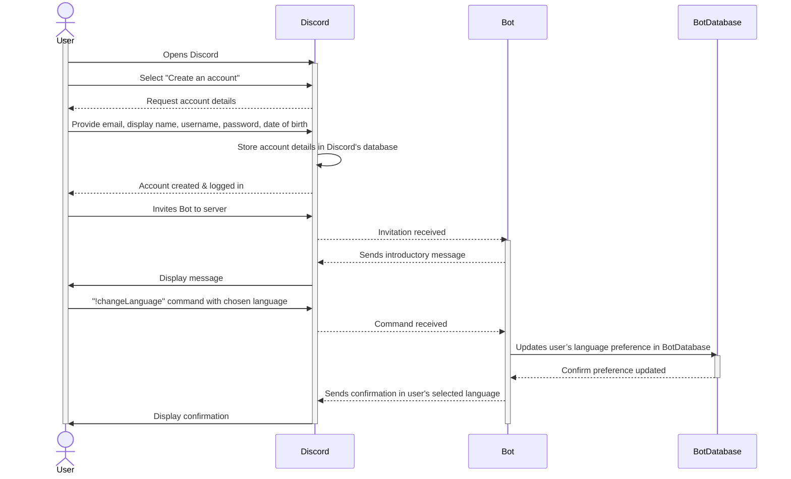
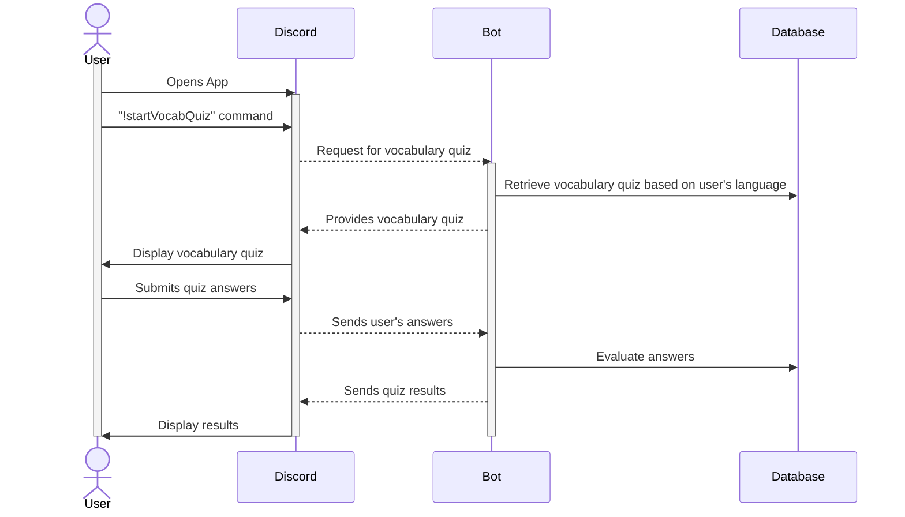
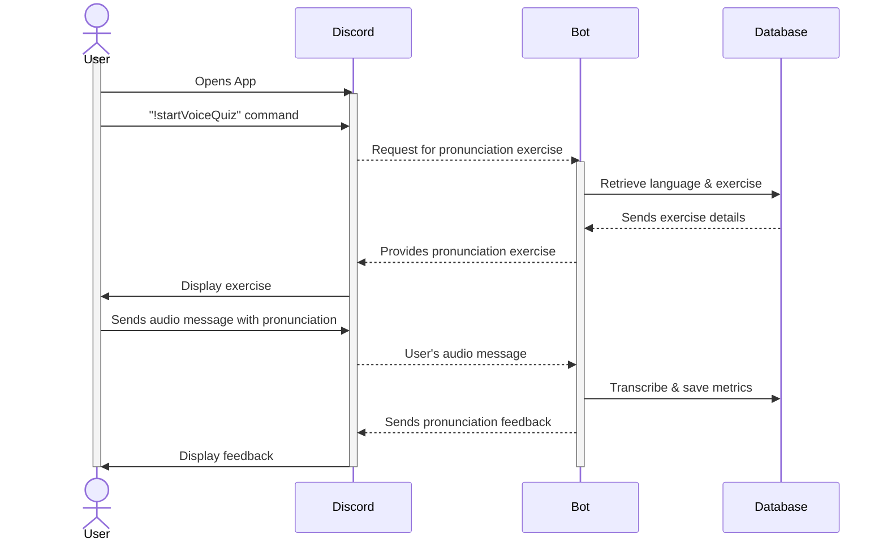

# Sequence Diagram

## Use Case 1: Account Creation and Language Selection

**User wants to create a Discord account to try out the language-learning bot and select a language.**

    1: User opens Discord and selects the "Create an account" option.
    2: User provides required details such as email, display name, username, password, and date of birth.
    3: Discord stores the provided account details in its database and confirms successful account creation.
    4: Discord confirms to the user that the account is created, and the user is logged in.
    5: User invites the bot to their server.
    6: Bot sends an introductory message upon joining the server.
    7: User sends a command to the bot to set language preferences.
    8: Bot updates the user’s language preference in the database.
    9: Database confirms the preference has been updated.
    10: Bot sends a confirmation message in the user's selected language.

## Use Case 2: Vocabulary Testing

**User wants to improve their language skills by taking a vocabulary quiz.**

    1: User opens the Discord app.
    2: User sends a command to initiate a vocabulary test.
    3: Bot retrieves vocabulary quizzes from the database in the user’s selected language.
    4: User takes the vocabulary quiz generated by the bot.
    5: Bot evaluates the user's answers, checking syntax and spelling.
    6: Bot updates the database with the user's quiz results.
    7: Bot sends a message to the user, presenting the quiz results.
    8: User reviews the result, understanding their strengths and area of improvement.

## Use Case 3: Pronunciation Testing

**User wants to improve their speaking skills by taking a pronunciation quiz.**

    1: User opens the Discord app.
    2: User sends a command, e.g., "!startVoiceQuiz" to initiate the pronunciation quiz.
    3: Bot retrieves the user’s preferred language and related exercise from the database.
    4: User sends an audio message with the given text or sentences' pronunciation.
    5: As the user speaks, the bot listens and transcribes the user’s audio.
    6: Bot updates the database with the transcription and performance metrics.
    7: Bot provides feedback on pronunciation accuracy and areas for improvement.
    8: User review the feedback to understand their pronunciation accuracy and areas of improvement.

## Use Case 4: Tracking Progress

**User wants to review their scores thus far from using the bot.**

    1: User opens the Discord app.
    2: User sends the “!myScores” command to the bot.
    3: Bot fetches the user’s scores from the database.
    4: Bot presents the user with their scores for vocabulary quizzes, pronunciation tests, and overall progress on Discord.

## Use Case 5: Viewing Top Performers for Each Language

**User wants to view top performers for each language to gauge their progress against peers.**

    1: User opens the Discord app.
    2: User sends the “!leaderboard” command to the bot.
    3: Bot retrieves top aggregate scores for the currently selected language from the database.
    4: Bot displays the leaderboard to the user on Discord.

## Use Case 6: Changing Current Learning Language

**User wants to change their current learning language to explore other languages.**

    1: User opens the Discord app.
    2: User sends the “!changeLanguage” command to the bot.
    3: Bot displays a list of available languages to the user on Discord.
    4: User selects a new language from the list.
    5: Bot updates the user’s preferred language in the database.
    6: Bot confirms the change to the user on Discord.

    
